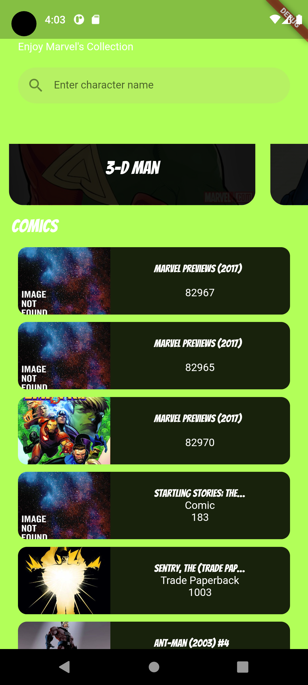

# Comic center

A simple app to display movies and allow searches

## Stacks & Tools

 

## Preview

<table>
 <tr>
    <td>
       <div style="width: 200px;"> </div>
    </td>
    <td>
        
    </td>
 </tr>
</table>

## Features

Comic center includes the following key features:

- View List of paginated movies.
- Search movies by Titles.
- Movie dashboard.

## Project Structure

Comic center follows the MVC Architecture for better organization and maintainability. Here's an overview of the main folders and their purposes:

- `lib`: This is the core folder of the project and contains all the Dart code.
  - `screens`: Contains the UI screens of the application, each screen in its own file.
  - `widgets`: Holds reusable UI components that are used across multiple screens.
  - `models`: Contains the data models used in the application.
  - `services`: Provides service classes responsible for handling API calls, local data storage, etc.
  - `repository`: Contains utility/helper functions used throughout the project.
 
  - `main.dart`: The entry point of the application.

- `assets`: Contains static assets such as images, fonts, and configuration files.

- `test`: Holds unit tests for the project.

- `android` and `ios`: These folders contain the native Android and iOS project files, respectively.

- `pubspec.yaml`: The project's configuration file where dependencies and assets are declared.

## Prerequisites

To run this project you must meet the following requirements:

- Use Flutter SDK version 3.3.9
- Install Visual Studio Code or Android Studio
- Andriod SDKs

## Project Setup

1. install the [Flutter SDK](https://storage.googleapis.com/flutter_infra_release/releases/stable/windows/flutter_windows_3.10.2-stable.zip)
2. Download [Visual Studio Code](https://code.visualstudio.com/Download) or [Android Studio](https://developer.android.com/studio/)
3. Set up an andriod emulator or run software on a physical device. Follow this [link](https://www.fluttercampus.com/tutorial/4/run-first-application/) to set up physical device or emulator.
4. Install Flutter and dart extensions
5. Install Flutter version manager (fvm) using
 ```dart pub global activate fvm```
6. Clone the project from github

## Install Project

1. Clone the repository:
```git clone https://github.com/Amali-Tech/event_manager_flutter.git```

2. Change directory:
```cd my-project (The directory where you cloned your project)```

3. In the project open the terminal and install 3.3.9 using 
```fvm install 3.3.9```

4. Ask fvm to use flutter version 3.3.9 for this project using 
``` fvm use 3.3.9 ```

5. install dependencies:
```fvm flutter pub get```

6. start application
```fvm flutter run```

## Environment Variables

You don't need an environment variable in your project to run this project

